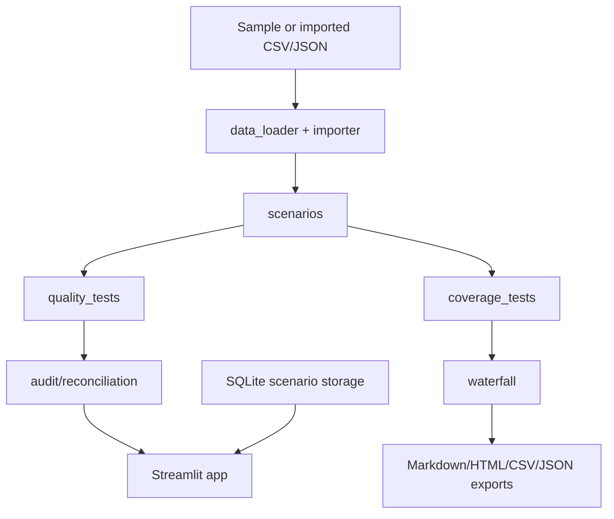

# ParGuard CLO Surveillance

ParGuard is a local, deterministic CLO surveillance demo for collateral monitoring, coverage-test tracking, scenario stress analysis, simplified waterfall cash diversion, import validation, and institutional-style memo exports.

> Synthetic / illustrative only. ParGuard is not a trustee report, rating, valuation, investment recommendation, or legal analysis.

## Screenshots

- `docs/screenshots/deal-overview.png` — Deal Overview and Analyst Morning Brief.
- `docs/screenshots/model-audit.png` — Model Audit & Reconciliation tab.
- `docs/screenshots/report-ingestion.png` — CSV/PDF educational import workflow.

## Architecture



## Stack

Python, pandas, Pydantic, pytest, Streamlit, Plotly, and SQLite. The core model runs locally with synthetic sample data and no API key.

## Setup

```bash
cd parguard-clo-surveillance
python -m venv .venv
source .venv/bin/activate
python -m pip install -r requirements.txt
```

## Run

```bash
streamlit run app/main.py
```

## Test

```bash
pytest -q
```

## Standard demo flow

1. Open Deal Overview and explain the sample collateral pool and liabilities.
2. Use Analyst Morning Brief to identify current risk state and closest coverage test.
3. Open Collateral Surveillance for quality tests, top obligors, and heatmaps.
4. Run CCC Migration Shock or Severe Default and Recovery Shock.
5. Review OC/IC test numerator, denominator, trigger, cushion, status, base-case change, and formula.
6. Open Cash Flow Waterfall to show residual interest diversion to debt paydown when tests fail.
7. Open Model Audit & Reconciliation to verify bridges and cash reconciliation.
8. Export the surveillance memo and model output files.

## Scope and limitations

ParGuard intentionally uses simplified, transparent calculations. It does not model every CLO indenture provision, trustee-report convention, trading restriction, fee rule, tax item, hedge, payment-date convention, or rating-agency methodology. See `MODEL_LIMITATIONS.md`.

## Résumé bullets

- Built deterministic CLO surveillance app with collateral-quality tests, OC/IC coverage tests, and stress-scenario attribution.
- Implemented simplified CLO waterfall showing test-driven cash diversion from equity to senior-debt paydown.
- Added schema-validated trustee-report-inspired CSV import workflow with downloadable templates and error reports.
- Produced analyst-ready model audit, reconciliation, and memo exports in Markdown, HTML, CSV, and JSON.

## Future roadmap

- Add richer deal-term configuration and versioned local deal storage.
- Add payment-date vectors and reinvestment-period mechanics.
- Add optional user-authored scenario libraries and more robust PDF field extraction.
